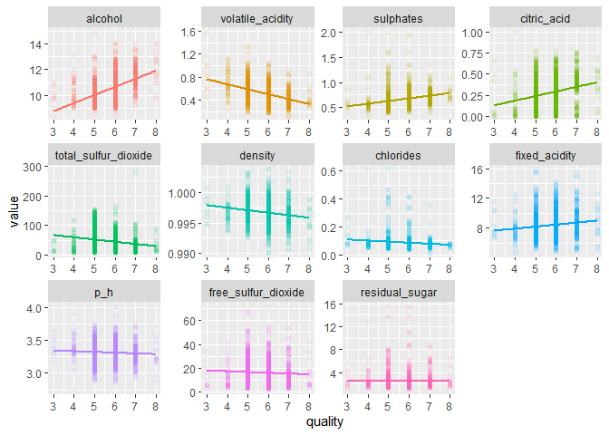

Exploratory Analysis of Red Wine Data
================
Daniel Dulaney
October 31, 2020

``` r
library(tidyverse)
library(here)
library(skimr)
```

``` r
red_wine <- read_csv(here("final-project", "red_wine.csv")) %>% 
  # add underscore to spaces in variable names
  janitor::clean_names()
```

    ## Parsed with column specification:
    ## cols(
    ##   `fixed acidity` = col_double(),
    ##   `volatile acidity` = col_double(),
    ##   `citric acid` = col_double(),
    ##   `residual sugar` = col_double(),
    ##   chlorides = col_double(),
    ##   `free sulfur dioxide` = col_double(),
    ##   `total sulfur dioxide` = col_double(),
    ##   density = col_double(),
    ##   pH = col_double(),
    ##   sulphates = col_double(),
    ##   alcohol = col_double(),
    ##   quality = col_double()
    ## )

``` r
skim(red_wine)
```

|                                                  |           |
|:-------------------------------------------------|:----------|
| Name                                             | red\_wine |
| Number of rows                                   | 1599      |
| Number of columns                                | 12        |
| \_\_\_\_\_\_\_\_\_\_\_\_\_\_\_\_\_\_\_\_\_\_\_   |           |
| Column type frequency:                           |           |
| numeric                                          | 12        |
| \_\_\_\_\_\_\_\_\_\_\_\_\_\_\_\_\_\_\_\_\_\_\_\_ |           |
| Group variables                                  | None      |

**Variable type: numeric**

| skim\_variable         |  n\_missing|  complete\_rate|   mean|     sd|    p0|    p25|    p50|    p75|    p100| hist  |
|:-----------------------|-----------:|---------------:|------:|------:|-----:|------:|------:|------:|-------:|:------|
| fixed\_acidity         |           0|               1|   8.32|   1.74|  4.60|   7.10|   7.90|   9.20|   15.90| ▂▇▂▁▁ |
| volatile\_acidity      |           0|               1|   0.53|   0.18|  0.12|   0.39|   0.52|   0.64|    1.58| ▅▇▂▁▁ |
| citric\_acid           |           0|               1|   0.27|   0.19|  0.00|   0.09|   0.26|   0.42|    1.00| ▇▆▅▁▁ |
| residual\_sugar        |           0|               1|   2.54|   1.41|  0.90|   1.90|   2.20|   2.60|   15.50| ▇▁▁▁▁ |
| chlorides              |           0|               1|   0.09|   0.05|  0.01|   0.07|   0.08|   0.09|    0.61| ▇▁▁▁▁ |
| free\_sulfur\_dioxide  |           0|               1|  15.87|  10.46|  1.00|   7.00|  14.00|  21.00|   72.00| ▇▅▁▁▁ |
| total\_sulfur\_dioxide |           0|               1|  46.47|  32.90|  6.00|  22.00|  38.00|  62.00|  289.00| ▇▂▁▁▁ |
| density                |           0|               1|   1.00|   0.00|  0.99|   1.00|   1.00|   1.00|    1.00| ▁▃▇▂▁ |
| p\_h                   |           0|               1|   3.31|   0.15|  2.74|   3.21|   3.31|   3.40|    4.01| ▁▅▇▂▁ |
| sulphates              |           0|               1|   0.66|   0.17|  0.33|   0.55|   0.62|   0.73|    2.00| ▇▅▁▁▁ |
| alcohol                |           0|               1|  10.42|   1.07|  8.40|   9.50|  10.20|  11.10|   14.90| ▇▇▃▁▁ |
| quality                |           0|               1|   5.64|   0.81|  3.00|   5.00|   6.00|   6.00|    8.00| ▁▇▇▂▁ |

``` r
red_wine %>% 
  pivot_longer(cols = everything(), names_to = "property") %>% 
  ggplot(aes(value, fill = property)) +
  geom_histogram() +
  facet_wrap(~property, scales = "free") +
  ggeasy::easy_remove_legend()
```

    ## `stat_bin()` using `bins = 30`. Pick better value with `binwidth`.


``` r
# calculate correlations between properties and quality
cors <- red_wine %>% 
  cor() %>% 
  as.data.frame() %>% 
  rownames_to_column() %>% 
  select(rowname, quality) %>% 
  rename(cor_to_quality = quality,
         property = rowname)

# scatterplots, where facets are ordered from highest to lowest correlation with quality
red_wine %>% 
  pivot_longer(cols = fixed_acidity:alcohol, names_to = "property") %>% 
  inner_join(cors, by = "property") %>%
  mutate(property = fct_reorder(property, abs(cor_to_quality), .desc = TRUE)) %>% 
  ggplot(aes(quality, value, color = property)) +
  geom_point(alpha = .075) +
  geom_smooth(method = "lm", se = FALSE) + 
  facet_wrap(~property, scales = "free") +
  ggeasy::easy_remove_legend()
```

    ## `geom_smooth()` using formula 'y ~ x'



This tell us that of the higher rated wines, `alcohol` had high values and `volatile_acidity` had low values.
