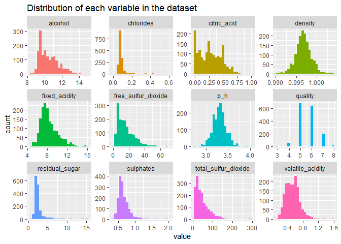

Exploratory Analysis of Red Wine Data
================
Daniel Dulaney
October 31, 2020

``` r
library(tidyverse)
library(here)
library(skimr)
library(ggcorrplot)
library(kableExtra)
```

``` r
red_wine <- read_csv(here("final-project", "red_wine.csv")) %>% 
  # replace spaces in variable names with underscores
  janitor::clean_names()
```

    ## Parsed with column specification:
    ## cols(
    ##   `fixed acidity` = col_double(),
    ##   `volatile acidity` = col_double(),
    ##   `citric acid` = col_double(),
    ##   `residual sugar` = col_double(),
    ##   chlorides = col_double(),
    ##   `free sulfur dioxide` = col_double(),
    ##   `total sulfur dioxide` = col_double(),
    ##   density = col_double(),
    ##   pH = col_double(),
    ##   sulphates = col_double(),
    ##   alcohol = col_double(),
    ##   quality = col_double()
    ## )

``` r
skim(red_wine)
```

<table style="width: auto;" class="table table-condensed">
<caption>
Data summary
</caption>
<thead>
<tr>
<th style="text-align:left;">
</th>
<th style="text-align:left;">
</th>
</tr>
</thead>
<tbody>
<tr>
<td style="text-align:left;">
Name
</td>
<td style="text-align:left;">
red\_wine
</td>
</tr>
<tr>
<td style="text-align:left;">
Number of rows
</td>
<td style="text-align:left;">
1599
</td>
</tr>
<tr>
<td style="text-align:left;">
Number of columns
</td>
<td style="text-align:left;">
12
</td>
</tr>
<tr>
<td style="text-align:left;">
\_\_\_\_\_\_\_\_\_\_\_\_\_\_\_\_\_\_\_\_\_\_\_
</td>
<td style="text-align:left;">
</td>
</tr>
<tr>
<td style="text-align:left;">
Column type frequency:
</td>
<td style="text-align:left;">
</td>
</tr>
<tr>
<td style="text-align:left;">
numeric
</td>
<td style="text-align:left;">
12
</td>
</tr>
<tr>
<td style="text-align:left;">
\_\_\_\_\_\_\_\_\_\_\_\_\_\_\_\_\_\_\_\_\_\_\_\_
</td>
<td style="text-align:left;">
</td>
</tr>
<tr>
<td style="text-align:left;">
Group variables
</td>
<td style="text-align:left;">
None
</td>
</tr>
</tbody>
</table>
**Variable type: numeric**

<table>
<thead>
<tr>
<th style="text-align:left;">
skim\_variable
</th>
<th style="text-align:right;">
n\_missing
</th>
<th style="text-align:right;">
complete\_rate
</th>
<th style="text-align:right;">
mean
</th>
<th style="text-align:right;">
sd
</th>
<th style="text-align:right;">
p0
</th>
<th style="text-align:right;">
p25
</th>
<th style="text-align:right;">
p50
</th>
<th style="text-align:right;">
p75
</th>
<th style="text-align:right;">
p100
</th>
<th style="text-align:left;">
hist
</th>
</tr>
</thead>
<tbody>
<tr>
<td style="text-align:left;">
fixed\_acidity
</td>
<td style="text-align:right;">
0
</td>
<td style="text-align:right;">
1
</td>
<td style="text-align:right;">
8.32
</td>
<td style="text-align:right;">
1.74
</td>
<td style="text-align:right;">
4.60
</td>
<td style="text-align:right;">
7.10
</td>
<td style="text-align:right;">
7.90
</td>
<td style="text-align:right;">
9.20
</td>
<td style="text-align:right;">
15.90
</td>
<td style="text-align:left;">
&lt;U+2582&gt;&lt;U+2587&gt;&lt;U+2582&gt;&lt;U+2581&gt;&lt;U+2581&gt;
</td>
</tr>
<tr>
<td style="text-align:left;">
volatile\_acidity
</td>
<td style="text-align:right;">
0
</td>
<td style="text-align:right;">
1
</td>
<td style="text-align:right;">
0.53
</td>
<td style="text-align:right;">
0.18
</td>
<td style="text-align:right;">
0.12
</td>
<td style="text-align:right;">
0.39
</td>
<td style="text-align:right;">
0.52
</td>
<td style="text-align:right;">
0.64
</td>
<td style="text-align:right;">
1.58
</td>
<td style="text-align:left;">
&lt;U+2585&gt;&lt;U+2587&gt;&lt;U+2582&gt;&lt;U+2581&gt;&lt;U+2581&gt;
</td>
</tr>
<tr>
<td style="text-align:left;">
citric\_acid
</td>
<td style="text-align:right;">
0
</td>
<td style="text-align:right;">
1
</td>
<td style="text-align:right;">
0.27
</td>
<td style="text-align:right;">
0.19
</td>
<td style="text-align:right;">
0.00
</td>
<td style="text-align:right;">
0.09
</td>
<td style="text-align:right;">
0.26
</td>
<td style="text-align:right;">
0.42
</td>
<td style="text-align:right;">
1.00
</td>
<td style="text-align:left;">
&lt;U+2587&gt;&lt;U+2586&gt;&lt;U+2585&gt;&lt;U+2581&gt;&lt;U+2581&gt;
</td>
</tr>
<tr>
<td style="text-align:left;">
residual\_sugar
</td>
<td style="text-align:right;">
0
</td>
<td style="text-align:right;">
1
</td>
<td style="text-align:right;">
2.54
</td>
<td style="text-align:right;">
1.41
</td>
<td style="text-align:right;">
0.90
</td>
<td style="text-align:right;">
1.90
</td>
<td style="text-align:right;">
2.20
</td>
<td style="text-align:right;">
2.60
</td>
<td style="text-align:right;">
15.50
</td>
<td style="text-align:left;">
&lt;U+2587&gt;&lt;U+2581&gt;&lt;U+2581&gt;&lt;U+2581&gt;&lt;U+2581&gt;
</td>
</tr>
<tr>
<td style="text-align:left;">
chlorides
</td>
<td style="text-align:right;">
0
</td>
<td style="text-align:right;">
1
</td>
<td style="text-align:right;">
0.09
</td>
<td style="text-align:right;">
0.05
</td>
<td style="text-align:right;">
0.01
</td>
<td style="text-align:right;">
0.07
</td>
<td style="text-align:right;">
0.08
</td>
<td style="text-align:right;">
0.09
</td>
<td style="text-align:right;">
0.61
</td>
<td style="text-align:left;">
&lt;U+2587&gt;&lt;U+2581&gt;&lt;U+2581&gt;&lt;U+2581&gt;&lt;U+2581&gt;
</td>
</tr>
<tr>
<td style="text-align:left;">
free\_sulfur\_dioxide
</td>
<td style="text-align:right;">
0
</td>
<td style="text-align:right;">
1
</td>
<td style="text-align:right;">
15.87
</td>
<td style="text-align:right;">
10.46
</td>
<td style="text-align:right;">
1.00
</td>
<td style="text-align:right;">
7.00
</td>
<td style="text-align:right;">
14.00
</td>
<td style="text-align:right;">
21.00
</td>
<td style="text-align:right;">
72.00
</td>
<td style="text-align:left;">
&lt;U+2587&gt;&lt;U+2585&gt;&lt;U+2581&gt;&lt;U+2581&gt;&lt;U+2581&gt;
</td>
</tr>
<tr>
<td style="text-align:left;">
total\_sulfur\_dioxide
</td>
<td style="text-align:right;">
0
</td>
<td style="text-align:right;">
1
</td>
<td style="text-align:right;">
46.47
</td>
<td style="text-align:right;">
32.90
</td>
<td style="text-align:right;">
6.00
</td>
<td style="text-align:right;">
22.00
</td>
<td style="text-align:right;">
38.00
</td>
<td style="text-align:right;">
62.00
</td>
<td style="text-align:right;">
289.00
</td>
<td style="text-align:left;">
&lt;U+2587&gt;&lt;U+2582&gt;&lt;U+2581&gt;&lt;U+2581&gt;&lt;U+2581&gt;
</td>
</tr>
<tr>
<td style="text-align:left;">
density
</td>
<td style="text-align:right;">
0
</td>
<td style="text-align:right;">
1
</td>
<td style="text-align:right;">
1.00
</td>
<td style="text-align:right;">
0.00
</td>
<td style="text-align:right;">
0.99
</td>
<td style="text-align:right;">
1.00
</td>
<td style="text-align:right;">
1.00
</td>
<td style="text-align:right;">
1.00
</td>
<td style="text-align:right;">
1.00
</td>
<td style="text-align:left;">
&lt;U+2581&gt;&lt;U+2583&gt;&lt;U+2587&gt;&lt;U+2582&gt;&lt;U+2581&gt;
</td>
</tr>
<tr>
<td style="text-align:left;">
p\_h
</td>
<td style="text-align:right;">
0
</td>
<td style="text-align:right;">
1
</td>
<td style="text-align:right;">
3.31
</td>
<td style="text-align:right;">
0.15
</td>
<td style="text-align:right;">
2.74
</td>
<td style="text-align:right;">
3.21
</td>
<td style="text-align:right;">
3.31
</td>
<td style="text-align:right;">
3.40
</td>
<td style="text-align:right;">
4.01
</td>
<td style="text-align:left;">
&lt;U+2581&gt;&lt;U+2585&gt;&lt;U+2587&gt;&lt;U+2582&gt;&lt;U+2581&gt;
</td>
</tr>
<tr>
<td style="text-align:left;">
sulphates
</td>
<td style="text-align:right;">
0
</td>
<td style="text-align:right;">
1
</td>
<td style="text-align:right;">
0.66
</td>
<td style="text-align:right;">
0.17
</td>
<td style="text-align:right;">
0.33
</td>
<td style="text-align:right;">
0.55
</td>
<td style="text-align:right;">
0.62
</td>
<td style="text-align:right;">
0.73
</td>
<td style="text-align:right;">
2.00
</td>
<td style="text-align:left;">
&lt;U+2587&gt;&lt;U+2585&gt;&lt;U+2581&gt;&lt;U+2581&gt;&lt;U+2581&gt;
</td>
</tr>
<tr>
<td style="text-align:left;">
alcohol
</td>
<td style="text-align:right;">
0
</td>
<td style="text-align:right;">
1
</td>
<td style="text-align:right;">
10.42
</td>
<td style="text-align:right;">
1.07
</td>
<td style="text-align:right;">
8.40
</td>
<td style="text-align:right;">
9.50
</td>
<td style="text-align:right;">
10.20
</td>
<td style="text-align:right;">
11.10
</td>
<td style="text-align:right;">
14.90
</td>
<td style="text-align:left;">
&lt;U+2587&gt;&lt;U+2587&gt;&lt;U+2583&gt;&lt;U+2581&gt;&lt;U+2581&gt;
</td>
</tr>
<tr>
<td style="text-align:left;">
quality
</td>
<td style="text-align:right;">
0
</td>
<td style="text-align:right;">
1
</td>
<td style="text-align:right;">
5.64
</td>
<td style="text-align:right;">
0.81
</td>
<td style="text-align:right;">
3.00
</td>
<td style="text-align:right;">
5.00
</td>
<td style="text-align:right;">
6.00
</td>
<td style="text-align:right;">
6.00
</td>
<td style="text-align:right;">
8.00
</td>
<td style="text-align:left;">
&lt;U+2581&gt;&lt;U+2587&gt;&lt;U+2587&gt;&lt;U+2582&gt;&lt;U+2581&gt;
</td>
</tr>
</tbody>
</table>
``` r
red_wine %>% 
  pivot_longer(cols = everything(), names_to = "property") %>% 
  ggplot(aes(value, fill = property)) +
  geom_histogram(bins = 25) +
  facet_wrap(~property, scales = "free") +
  ggeasy::easy_remove_legend() +
  labs(title = "Distribution of each variable in the dataset")
```



``` r
# count of Quality ratings?
red_wine %>%
  count(quality) %>%
  mutate(freq = n / sum(n),
         freq = round(freq, 2)) %>% 
  kable(caption = "Frequency of quality ratings") %>% 
  kable_styling(full_width = FALSE, bootstrap_options = "striped")
```

<table class="table table-striped" style="width: auto !important; margin-left: auto; margin-right: auto;">
<caption>
Frequency of quality ratings
</caption>
<thead>
<tr>
<th style="text-align:right;">
quality
</th>
<th style="text-align:right;">
n
</th>
<th style="text-align:right;">
freq
</th>
</tr>
</thead>
<tbody>
<tr>
<td style="text-align:right;">
3
</td>
<td style="text-align:right;">
10
</td>
<td style="text-align:right;">
0.01
</td>
</tr>
<tr>
<td style="text-align:right;">
4
</td>
<td style="text-align:right;">
53
</td>
<td style="text-align:right;">
0.03
</td>
</tr>
<tr>
<td style="text-align:right;">
5
</td>
<td style="text-align:right;">
681
</td>
<td style="text-align:right;">
0.43
</td>
</tr>
<tr>
<td style="text-align:right;">
6
</td>
<td style="text-align:right;">
638
</td>
<td style="text-align:right;">
0.40
</td>
</tr>
<tr>
<td style="text-align:right;">
7
</td>
<td style="text-align:right;">
199
</td>
<td style="text-align:right;">
0.12
</td>
</tr>
<tr>
<td style="text-align:right;">
8
</td>
<td style="text-align:right;">
18
</td>
<td style="text-align:right;">
0.01
</td>
</tr>
</tbody>
</table>
``` r
# calculate correlations between properties and quality
cors <- red_wine %>% 
  cor() %>% 
  as.data.frame() %>% 
  rownames_to_column() %>% 
  select(rowname, quality) %>% 
  rename(cor_to_quality = quality,
         property = rowname)

# scatterplots, where facets are ordered from highest to lowest correlation with quality
red_wine %>% 
  pivot_longer(cols = fixed_acidity:alcohol, names_to = "property") %>% 
  inner_join(cors, by = "property") %>%
  mutate(property = fct_reorder(property, abs(cor_to_quality), .desc = TRUE)) %>% 
  ggplot(aes(quality, value, color = property)) +
  geom_point(alpha = .075) +
  geom_smooth(method = "lm", se = FALSE) + 
  facet_wrap(~property, scales = "free") +
  ggeasy::easy_remove_legend() +
  labs(title = "Relationship between quality and each variable in the dataset",
       y = "value_of_var")
```

    ## `geom_smooth()` using formula 'y ~ x'


This tell us that of the higher rated wines, `alcohol` had high values and `volatile_acidity` had low values.

``` r
# check correlation between variables-- any signs of multicollinearity?
red_wine %>% 
  cor() %>% 
  ggcorrplot(title = "Linear relationships between red wine dataset variables", 
             type = "lower", hc.order = TRUE, lab = TRUE, lab_size = 2.5)
```


