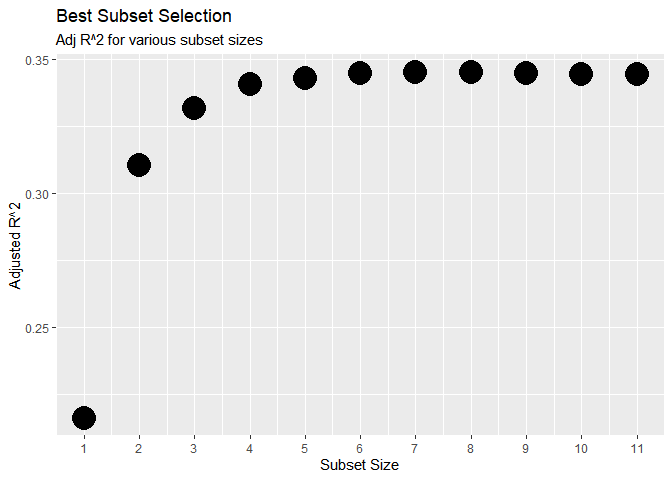

Daniel Dulaney
November 11, 2020

``` r
library(tidyverse)
```

    ## -- Attaching packages ----------------------------------------------------------------------- tidyverse 1.3.0 --

    ## v ggplot2 3.3.2     v purrr   0.3.4
    ## v tibble  3.0.3     v dplyr   1.0.2
    ## v tidyr   1.1.2     v stringr 1.4.0
    ## v readr   1.3.1     v forcats 0.5.0

    ## -- Conflicts -------------------------------------------------------------------------- tidyverse_conflicts() --
    ## x dplyr::filter() masks stats::filter()
    ## x dplyr::lag()    masks stats::lag()

``` r
library(here)
```

    ## here() starts at C:/Users/dgdul/OneDrive/Documents/grad-school/st-563

``` r
library(leaps)
library(patchwork)
library(kableExtra)
```

    ## 
    ## Attaching package: 'kableExtra'

    ## The following object is masked from 'package:dplyr':
    ## 
    ##     group_rows

``` r
red <- read_csv(here("final-project", "red_wine.csv")) %>% 
  # replace spaces in variable names with underscores
  janitor::clean_names()
```

    ## Parsed with column specification:
    ## cols(
    ##   `fixed acidity` = col_double(),
    ##   `volatile acidity` = col_double(),
    ##   `citric acid` = col_double(),
    ##   `residual sugar` = col_double(),
    ##   chlorides = col_double(),
    ##   `free sulfur dioxide` = col_double(),
    ##   `total sulfur dioxide` = col_double(),
    ##   density = col_double(),
    ##   pH = col_double(),
    ##   sulphates = col_double(),
    ##   alcohol = col_double(),
    ##   quality = col_double()
    ## )

``` r
set.seed(1)

train <- sample(dim(red)[1], dim(red)[1] / 2)
red.train <- red[train, ]
red.test <- red[-train, ]
```

Best Subset Selection
---------------------

``` r
regfit_full <- regsubsets(quality ~ ., nvmax = 11, method = "exhaustive", data = red.train)

reg_summary_full <- summary(regfit_full)

subset_vars <- reg_summary_full$which %>% 
  as_tibble()
# turn this table into one that has values as var names and rows as best subsets 1-11. so like 
# 1 alcohol
# 2 alcohol volatile_acidity

subset_vars <- subset_vars %>% 
  select(-1) %>% 
  mutate(subset_size = row_number()) %>% 
  select(subset_size, everything()) %>% 
  mutate_if(is.logical, as.character) %>% 
  mutate_if(is.integer, as.character) %>% 
  mutate_all(~ifelse(. == TRUE, "1", "0"))

for (i in 1:ncol(subset_vars)) {
  for (j in 1:nrow(subset_vars)) {
    if (subset_vars[j, i] == "0") {
      subset_vars[j, i] <- ""
    }
    else if (subset_vars[j, i] == "1") {
      subset_vars[j, i] <- names(subset_vars)[i]
    }
  }
}

# reorder columns
subset_vars <- subset_vars %>% 
  mutate(subset_size = row_number()) %>% 
  select(subset_size, alcohol, volatile_acidity, sulphates, total_sulfur_dioxide, p_h, free_sulfur_dioxide,
         chlorides, citric_acid, residual_sugar, fixed_acidity, density)

subset_vars %>% 
  kable(caption = "Variables selected for optimal subset at each subset size",
        col.names = c("subset_size", rep("", 11))) %>% 
  kable_styling(bootstrap_options = "striped", full_width = FALSE)
```

<table class="table table-striped" style="width: auto !important; margin-left: auto; margin-right: auto;">
<caption>
Variables selected for optimal subset at each subset size
</caption>
<thead>
<tr>
<th style="text-align:right;">
subset\_size
</th>
<th style="text-align:left;">
</th>
<th style="text-align:left;">
</th>
<th style="text-align:left;">
</th>
<th style="text-align:left;">
</th>
<th style="text-align:left;">
</th>
<th style="text-align:left;">
</th>
<th style="text-align:left;">
</th>
<th style="text-align:left;">
</th>
<th style="text-align:left;">
</th>
<th style="text-align:left;">
</th>
<th style="text-align:left;">
</th>
</tr>
</thead>
<tbody>
<tr>
<td style="text-align:right;">
1
</td>
<td style="text-align:left;">
alcohol
</td>
<td style="text-align:left;">
</td>
<td style="text-align:left;">
</td>
<td style="text-align:left;">
</td>
<td style="text-align:left;">
</td>
<td style="text-align:left;">
</td>
<td style="text-align:left;">
</td>
<td style="text-align:left;">
</td>
<td style="text-align:left;">
</td>
<td style="text-align:left;">
</td>
<td style="text-align:left;">
</td>
</tr>
<tr>
<td style="text-align:right;">
2
</td>
<td style="text-align:left;">
alcohol
</td>
<td style="text-align:left;">
volatile\_acidity
</td>
<td style="text-align:left;">
</td>
<td style="text-align:left;">
</td>
<td style="text-align:left;">
</td>
<td style="text-align:left;">
</td>
<td style="text-align:left;">
</td>
<td style="text-align:left;">
</td>
<td style="text-align:left;">
</td>
<td style="text-align:left;">
</td>
<td style="text-align:left;">
</td>
</tr>
<tr>
<td style="text-align:right;">
3
</td>
<td style="text-align:left;">
alcohol
</td>
<td style="text-align:left;">
volatile\_acidity
</td>
<td style="text-align:left;">
sulphates
</td>
<td style="text-align:left;">
</td>
<td style="text-align:left;">
</td>
<td style="text-align:left;">
</td>
<td style="text-align:left;">
</td>
<td style="text-align:left;">
</td>
<td style="text-align:left;">
</td>
<td style="text-align:left;">
</td>
<td style="text-align:left;">
</td>
</tr>
<tr>
<td style="text-align:right;">
4
</td>
<td style="text-align:left;">
alcohol
</td>
<td style="text-align:left;">
volatile\_acidity
</td>
<td style="text-align:left;">
sulphates
</td>
<td style="text-align:left;">
total\_sulfur\_dioxide
</td>
<td style="text-align:left;">
</td>
<td style="text-align:left;">
</td>
<td style="text-align:left;">
</td>
<td style="text-align:left;">
</td>
<td style="text-align:left;">
</td>
<td style="text-align:left;">
</td>
<td style="text-align:left;">
</td>
</tr>
<tr>
<td style="text-align:right;">
5
</td>
<td style="text-align:left;">
alcohol
</td>
<td style="text-align:left;">
volatile\_acidity
</td>
<td style="text-align:left;">
sulphates
</td>
<td style="text-align:left;">
total\_sulfur\_dioxide
</td>
<td style="text-align:left;">
p\_h
</td>
<td style="text-align:left;">
</td>
<td style="text-align:left;">
</td>
<td style="text-align:left;">
</td>
<td style="text-align:left;">
</td>
<td style="text-align:left;">
</td>
<td style="text-align:left;">
</td>
</tr>
<tr>
<td style="text-align:right;">
6
</td>
<td style="text-align:left;">
alcohol
</td>
<td style="text-align:left;">
volatile\_acidity
</td>
<td style="text-align:left;">
sulphates
</td>
<td style="text-align:left;">
total\_sulfur\_dioxide
</td>
<td style="text-align:left;">
p\_h
</td>
<td style="text-align:left;">
free\_sulfur\_dioxide
</td>
<td style="text-align:left;">
</td>
<td style="text-align:left;">
</td>
<td style="text-align:left;">
</td>
<td style="text-align:left;">
</td>
<td style="text-align:left;">
</td>
</tr>
<tr>
<td style="text-align:right;">
7
</td>
<td style="text-align:left;">
alcohol
</td>
<td style="text-align:left;">
volatile\_acidity
</td>
<td style="text-align:left;">
sulphates
</td>
<td style="text-align:left;">
total\_sulfur\_dioxide
</td>
<td style="text-align:left;">
p\_h
</td>
<td style="text-align:left;">
free\_sulfur\_dioxide
</td>
<td style="text-align:left;">
chlorides
</td>
<td style="text-align:left;">
</td>
<td style="text-align:left;">
</td>
<td style="text-align:left;">
</td>
<td style="text-align:left;">
</td>
</tr>
<tr>
<td style="text-align:right;">
8
</td>
<td style="text-align:left;">
alcohol
</td>
<td style="text-align:left;">
volatile\_acidity
</td>
<td style="text-align:left;">
sulphates
</td>
<td style="text-align:left;">
total\_sulfur\_dioxide
</td>
<td style="text-align:left;">
p\_h
</td>
<td style="text-align:left;">
free\_sulfur\_dioxide
</td>
<td style="text-align:left;">
chlorides
</td>
<td style="text-align:left;">
citric\_acid
</td>
<td style="text-align:left;">
</td>
<td style="text-align:left;">
</td>
<td style="text-align:left;">
</td>
</tr>
<tr>
<td style="text-align:right;">
9
</td>
<td style="text-align:left;">
alcohol
</td>
<td style="text-align:left;">
volatile\_acidity
</td>
<td style="text-align:left;">
sulphates
</td>
<td style="text-align:left;">
total\_sulfur\_dioxide
</td>
<td style="text-align:left;">
p\_h
</td>
<td style="text-align:left;">
free\_sulfur\_dioxide
</td>
<td style="text-align:left;">
chlorides
</td>
<td style="text-align:left;">
citric\_acid
</td>
<td style="text-align:left;">
residual\_sugar
</td>
<td style="text-align:left;">
</td>
<td style="text-align:left;">
</td>
</tr>
<tr>
<td style="text-align:right;">
10
</td>
<td style="text-align:left;">
alcohol
</td>
<td style="text-align:left;">
volatile\_acidity
</td>
<td style="text-align:left;">
sulphates
</td>
<td style="text-align:left;">
total\_sulfur\_dioxide
</td>
<td style="text-align:left;">
p\_h
</td>
<td style="text-align:left;">
free\_sulfur\_dioxide
</td>
<td style="text-align:left;">
chlorides
</td>
<td style="text-align:left;">
</td>
<td style="text-align:left;">
residual\_sugar
</td>
<td style="text-align:left;">
fixed\_acidity
</td>
<td style="text-align:left;">
density
</td>
</tr>
<tr>
<td style="text-align:right;">
11
</td>
<td style="text-align:left;">
alcohol
</td>
<td style="text-align:left;">
volatile\_acidity
</td>
<td style="text-align:left;">
sulphates
</td>
<td style="text-align:left;">
total\_sulfur\_dioxide
</td>
<td style="text-align:left;">
p\_h
</td>
<td style="text-align:left;">
free\_sulfur\_dioxide
</td>
<td style="text-align:left;">
chlorides
</td>
<td style="text-align:left;">
citric\_acid
</td>
<td style="text-align:left;">
residual\_sugar
</td>
<td style="text-align:left;">
fixed\_acidity
</td>
<td style="text-align:left;">
density
</td>
</tr>
</tbody>
</table>
``` r
cbind(subset_size = 1:11, adj_rsq = reg_summary_full$adjr2) %>%
  as_tibble() %>% 
  ggplot(aes(subset_size, adj_rsq)) +
  geom_point(size = 8) +
  scale_x_continuous(breaks = 1:11) +
  labs(title = "Best Subset Selection",
       subtitle = "Adj R^2 for various subset sizes",
       x = "Subset Size",
       y = "Adjusted R^2")
```



Forward Subset Selection
------------------------

``` r
regfit_forward <- regsubsets(quality ~ ., nvmax = 11, method = "forward", data = red.train)

reg_summary_forward <- summary(regfit_forward)

# only differences: Best Subset chooses 
```

Backward Subset Selection
-------------------------

``` r
regfit_backward <- regsubsets(quality ~ ., nvmax = 11, method = "backward", data = red.train)

reg_summary_backward <- summary(regfit_backward)

# only differences from best: 

reg_summary_backward
```

    ## Subset selection object
    ## Call: regsubsets.formula(quality ~ ., nvmax = 11, method = "backward", 
    ##     data = red.train)
    ## 11 Variables  (and intercept)
    ##                      Forced in Forced out
    ## fixed_acidity            FALSE      FALSE
    ## volatile_acidity         FALSE      FALSE
    ## citric_acid              FALSE      FALSE
    ## residual_sugar           FALSE      FALSE
    ## chlorides                FALSE      FALSE
    ## free_sulfur_dioxide      FALSE      FALSE
    ## total_sulfur_dioxide     FALSE      FALSE
    ## density                  FALSE      FALSE
    ## p_h                      FALSE      FALSE
    ## sulphates                FALSE      FALSE
    ## alcohol                  FALSE      FALSE
    ## 1 subsets of each size up to 11
    ## Selection Algorithm: backward
    ##           fixed_acidity volatile_acidity citric_acid residual_sugar chlorides
    ## 1  ( 1 )  " "           " "              " "         " "            " "      
    ## 2  ( 1 )  " "           "*"              " "         " "            " "      
    ## 3  ( 1 )  " "           "*"              " "         " "            " "      
    ## 4  ( 1 )  " "           "*"              " "         " "            " "      
    ## 5  ( 1 )  " "           "*"              " "         " "            " "      
    ## 6  ( 1 )  " "           "*"              " "         " "            " "      
    ## 7  ( 1 )  " "           "*"              " "         " "            "*"      
    ## 8  ( 1 )  " "           "*"              " "         "*"            "*"      
    ## 9  ( 1 )  " "           "*"              " "         "*"            "*"      
    ## 10  ( 1 ) "*"           "*"              " "         "*"            "*"      
    ## 11  ( 1 ) "*"           "*"              "*"         "*"            "*"      
    ##           free_sulfur_dioxide total_sulfur_dioxide density p_h sulphates
    ## 1  ( 1 )  " "                 " "                  " "     " " " "      
    ## 2  ( 1 )  " "                 " "                  " "     " " " "      
    ## 3  ( 1 )  " "                 " "                  " "     " " "*"      
    ## 4  ( 1 )  " "                 "*"                  " "     " " "*"      
    ## 5  ( 1 )  " "                 "*"                  " "     "*" "*"      
    ## 6  ( 1 )  "*"                 "*"                  " "     "*" "*"      
    ## 7  ( 1 )  "*"                 "*"                  " "     "*" "*"      
    ## 8  ( 1 )  "*"                 "*"                  " "     "*" "*"      
    ## 9  ( 1 )  "*"                 "*"                  "*"     "*" "*"      
    ## 10  ( 1 ) "*"                 "*"                  "*"     "*" "*"      
    ## 11  ( 1 ) "*"                 "*"                  "*"     "*" "*"      
    ##           alcohol
    ## 1  ( 1 )  "*"    
    ## 2  ( 1 )  "*"    
    ## 3  ( 1 )  "*"    
    ## 4  ( 1 )  "*"    
    ## 5  ( 1 )  "*"    
    ## 6  ( 1 )  "*"    
    ## 7  ( 1 )  "*"    
    ## 8  ( 1 )  "*"    
    ## 9  ( 1 )  "*"    
    ## 10  ( 1 ) "*"    
    ## 11  ( 1 ) "*"

``` r
# make plot of rsq vs # var
```

``` r
# combine the 3 plots into one (and maybe a fourth "image" that is a table containing the 11 best subset variable combinations)
```
